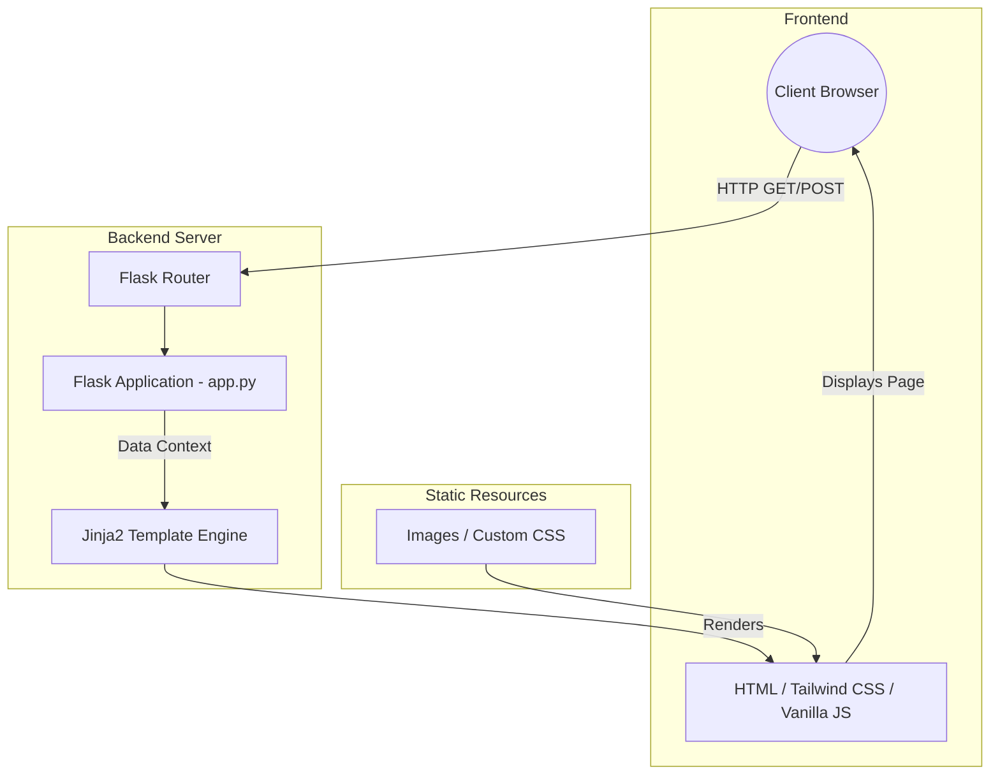

# Hospital Management AI-Powered System

Welcome to the **Hospital Management AI-Powered System**! This is a modern, comprehensive web application built with Python and Flask. It serves as a unified platform for patients to find top doctors, book appointments, and manage their health profiles securely. 

## 🚀 Features
- **Smart Doctor Search:** Filter doctors by specialty and view their professional profiles.
- **Appointment Booking:** Securely book and manage consultations with medical professionals.
- **User Authentication:** Login and Sign-up functionality to manage personal profiles and appointments.
- **Responsive UI:** Modern, aesthetic, and responsive design utilizing Tailwind CSS and custom styling.
- **Dedicated Information Pages:** Complete with About, Contact, and Jobs pages for hospital administration and inquiries.

## 🏗️ Architecture Diagram

Here is a high-level overview of the current system architecture:



*Note: The architecture is designed to be extensible to easily integrate upcoming AI-powered features for smart diagnostics and automated scheduling.*

## 📂 Project Structure

```text
.
├── app.py                      # Main Flask application and route definitions
├── remove_bg_and_crop.py       # Utility script for image processing
├── src/                        # Static assets
│   ├── css/                    # Custom stylesheets (e.g., style.css)
│   └── images/                 # Image assets (banners, doctors, etc.)
└── templates/                  # Jinja2 HTML templates
    ├── component/              # Reusable UI components (navbar, footer, etc.)
    ├── about.html              # About us page
    ├── appointment.html        # Booking interface
    ├── base.html               # Main layout wrapper
    ├── contact.html            # Contact page
    ├── doctors.html            # Doctors listing and filtering
    ├── home.html               # Landing page
    ├── jobs.html               # Careers page
    ├── login.html              # Authentication login
    ├── signup.html             # Authentication signup
    ├── my_appointments.html    # User's appointment dashboard
    └── profile.html            # User profile management
```

## 🛠️ Installation & Setup

1. **Clone the repository:**
   ```bash
   git clone https://github.com/SiddBali/hospital-management-ai-powerd-system.git
   cd "hospital-management-ai-powerd-system"
   ```

2. **Set up a virtual environment:**
   ```bash
   python3 -m venv venv
   source venv/bin/activate  # On Windows use `venv\Scripts\activate`
   ```

3. **Install Dependencies:**
   *(Ensure Flask is installed)*
   ```bash
   pip install Flask
   ```

4. **Run the Application:**
   ```bash
   python app.py
   ```
   The application will be accessible at `http://127.0.0.1:5000`.

## 🤝 Contributing
Contributions are welcome! If you would like to help build the AI features or improve the UI, feel free to open a Pull Request.